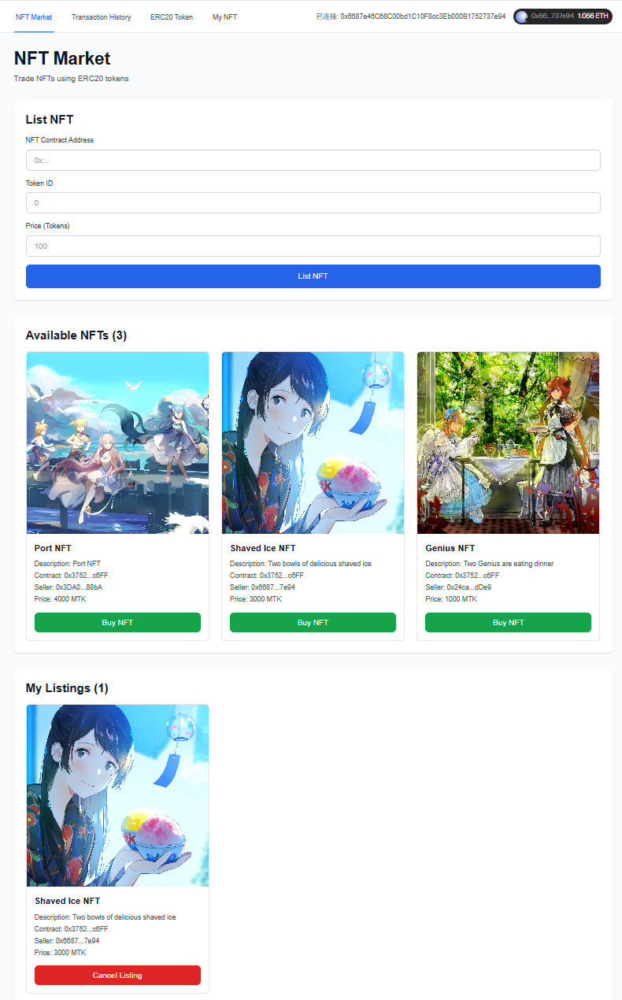

# NFTMarket Web Frontend

NFT市场的Next.js前端应用。

## 快速开始

### 1. 安装依赖

```bash
npm install
```

### 2. 配置环境变量

```bash
cp .env.example .env.local
```

编辑 `.env.local` 文件，填入：
- `NEXT_PUBLIC_WALLETCONNECT_PROJECT_ID` - 从 https://cloud.walletconnect.com/ 获取
- 部署的合约地址

### 3. 启动开发服务器

```bash
npm run dev
```

访问 http://localhost:3000

## 项目结构

```
web/
├── app/                    # Next.js App Router
│   ├── layout.tsx         # 根布局
│   ├── globals.css        # 全局样式
│   ├── page.tsx           # NFTMarket页面
│   ├── v2/                # NFTMarket V2页面
│   └── transactions/      # 买卖记录页面
├── components/             # React组件
│   ├── Navigation.tsx     # 导航栏
│   └── Web3Provider.tsx   # Web3提供者
├── lib/                   # 工具函数
│   ├── contracts.ts       # 合约地址管理
│   └── wagmi.ts          # Wagmi配置
├── contracts/             # 合约ABI
└── public/               # 静态资源
```

## 技术栈

- Next.js 15 (App Router)
- React 19
- TypeScript
- Tailwind CSS
- Wagmi (以太坊交互)
- Viem (以太坊工具库)
- RainbowKit (钱包连接)
- TanStack Query (数据获取)

## 学员替换指南

### 替换合约地址

编辑 `lib/contracts.ts`，更新 `CONTRACT_ADDRESSES` 对象：

```typescript
export const CONTRACT_ADDRESSES = {
  sepolia: {
    NFTMarket: '0xYourAddress...',
    NFTMarketV2: '0xYourAddress...',
    SimpleNFT: '0xYourAddress...',
  },
};
```

### 替换合约ABI

1. 编译合约后导出ABI：
   ```bash
   cd ../contracts
   cat out/YourContract.sol/YourContract.json | jq .abi > ../web/contracts/YourContract.json
   ```

2. 在组件中导入：
   ```typescript
   import YourContractABI from '@/contracts/YourContract.json';
   ```

### 添加新页面

1. 在 `app/` 目录下创建新文件夹
2. 添加 `page.tsx` 文件
3. 在 `components/Navigation.tsx` 中添加导航链接

## 常用命令

```bash
# 开发
npm run dev

# 构建
npm run build

# 启动生产服务器
npm start

# 代码检查
npm run lint
```

## NFT Market部署效果



## 更多信息

查看项目根目录的 README.md 获取完整文档。
